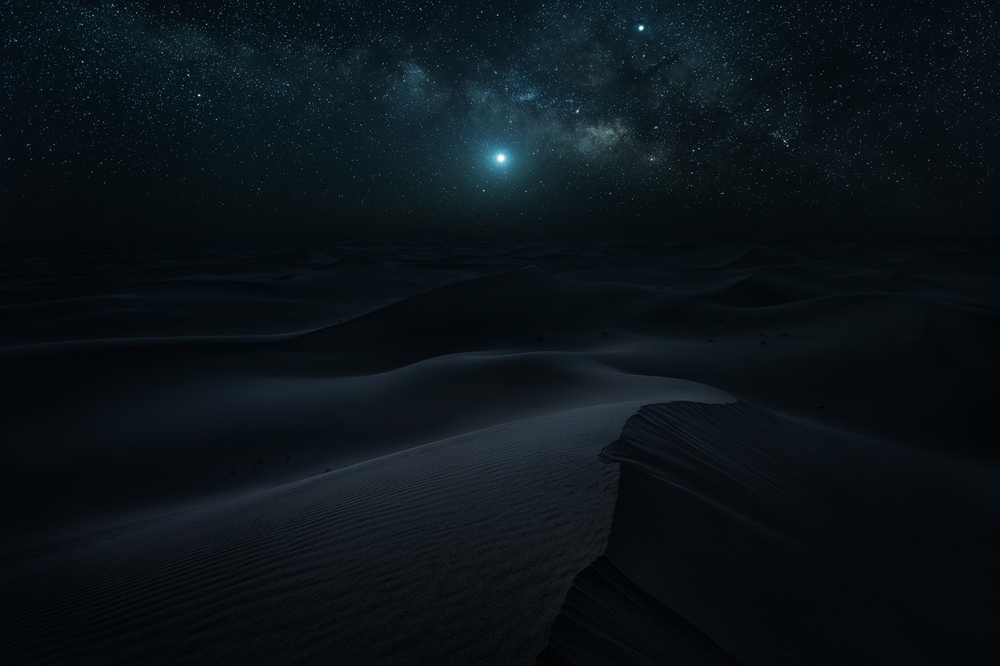
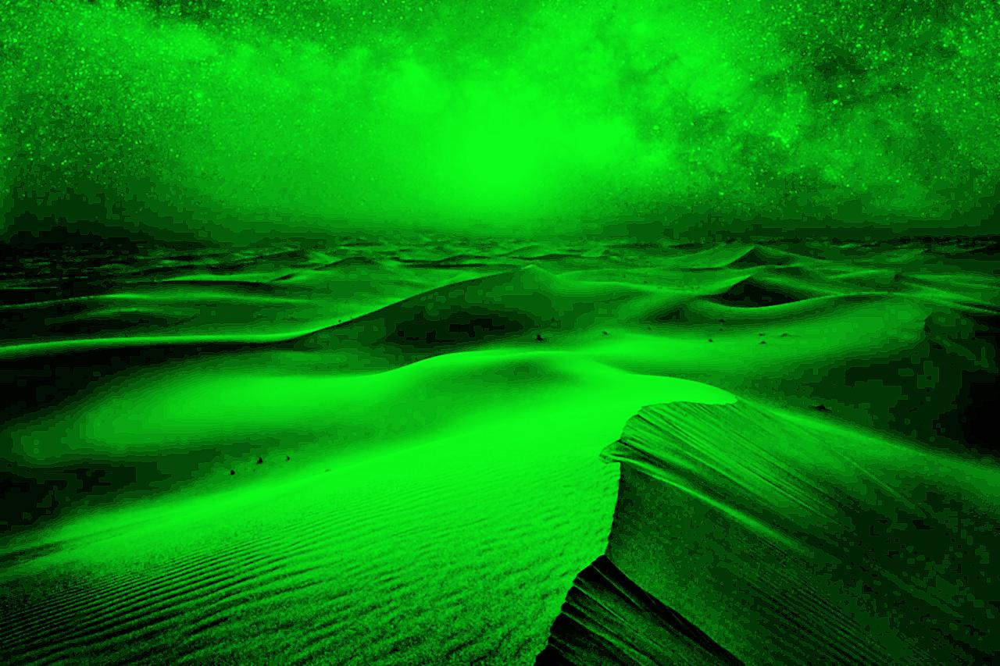

# Enhanced Night Vision Image Processor

Aplikasi pengolahan citra digital untuk meningkatkan kualitas gambar dengan teknik night vision enhancement. Aplikasi ini mengimplementasikan algoritma pengolahan citra dari scratch menggunakan Python dan NumPy.

## 📋 Deskripsi

Aplikasi ini adalah proyek UAS (Ujian Akhir Semester) untuk mata kuliah Pengolahan Citra Digital (PCD) Semester 4. Aplikasi mengimplementasikan pipeline lengkap untuk enhancing gambar dengan efek night vision menggunakan teknik-teknik pengolahan citra digital yang diimplementasikan dari dasar.

## ✨ Fitur Utama

### 🔧 Modul Noise Minimization
- **Median Filter**: Mengurangi salt-and-pepper noise dengan kernel yang dapat disesuaikan
- **Gaussian Filter**: Smoothing dengan kernel Gaussian yang dibuat dari formula matematika
- **2D Convolution**: Implementasi konvolusi 2D dari scratch

### 📊 Modul Contrast Enhancement
- **Histogram Equalization**: Pemerataan histogram untuk meningkatkan kontras
- **CDF Calculation**: Perhitungan Cumulative Distribution Function manual
- **Adaptive Contrast**: Enhancement kontras berdasarkan distribusi pixel

### 🎯 Modul Detail Enhancement
- **Unsharp Masking**: Teknik penajaman detail dengan parameter yang dapat disesuaikan
- **High-pass Filtering**: Ekstraksi detail halus dari gambar
- **Threshold Control**: Kontrol threshold untuk detail enhancement

### 🌈 Modul False-Color Mapping
- **Night Vision Effect**: Konversi ke efek night vision dengan dominasi warna hijau
- **Color Channel Mapping**: Mapping custom untuk menciptakan efek night vision yang realistis
- **Grayscale to RGB Conversion**: Konversi dari grayscale ke RGB dengan mapping khusus

## 🔬 Pipeline Pengolahan

Aplikasi menggunakan pipeline 4 tahap yang terstruktur:

1. **Noise Reduction**: Median filter → Gaussian smoothing
2. **Contrast Enhancement**: Histogram equalization
3. **Detail Enhancement**: Unsharp masking
4. **False-Color Mapping**: Night vision color effect

## 🛠️ Teknologi yang Digunakan

- **Python**: Bahasa pemrograman utama
- **NumPy**: Operasi array dan komputasi numerik
- **PIL (Pillow)**: Input/output gambar

## 📸 Hasil Pengolahan

| Original Image | Enhanced Image |
|-------|-----------|
|  |  |

## 📦 Instalasi

1. **Clone atau download repository ini**
   ```bash
   git clone https://github.com/AvavSam/enhanced-night-vision-F55123020.git
   cd enhanced-night-vision-F55123020
   ```

2. **Install dependencies yang diperlukan**
   ```bash
   pip install numpy
   pip install pillow
   ```

3. **Siapkan struktur folder**
   ```
   enhanced-night-vision-F55123020
   ├── main.py
   ├── img\
   │   └── desert.jpg    # Gambar input
   └── README.md
   ```

## 🚀 Cara Penggunaan

### Penggunaan Default
```bash
python main.py
```
*Aplikasi akan memproses gambar `./img/desert.jpg` dan menyimpan hasilnya sebagai `desert_enhanced.jpg`*

### Kustomisasi Input
Ubah path input dalam kode:
```python
input_path = './img/your_image.jpg'  # Ganti dengan path gambar Anda
```

### Parameter yang Dapat Disesuaikan

1. **Median Filter**:
   ```python
   median_filtered = self.median_filter(grayscale, kernel_size=3)  # 3, 5, 7, dll
   ```

2. **Gaussian Filter**:
   ```python
   denoised = self.gaussian_filter(median_filtered, sigma=0.8)  # 0.5 - 2.0
   ```

3. **Unsharp Masking**:
   ```python
   detail_enhanced = self.unsharp_masking(
       contrast_enhanced,
       radius=1.0,    # 0.5 - 3.0
       amount=1.5,    # 0.5 - 3.0
       threshold=0    # 0 - 50
   )
   ```

## 📁 Struktur Project

```
d:\Tugas\semester 4\UAS PCD\
├── main.py                 # File utama aplikasi
├── README.md              # Dokumentasi project
└── img/                   # Folder gambar
    ├── desert.jpg         # Gambar input sample
    └── desert_enhanced.jpg # Hasil output
```

## 💡 Contoh Output

Input: Gambar normal → Output: Gambar dengan efek night vision (dominasi hijau)

Karakteristik hasil:
- Noise berkurang signifikan
- Kontras meningkat
- Detail lebih tajam
- Efek night vision yang realistis

---

**Catatan**: Pastikan gambar input berada di folder `img/` dan memiliki format yang didukung (JPG, PNG, BMP). Aplikasi akan membuat file output di lokasi yang sama dengan suffix `_enhanced`.
